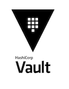

# Hands-on : Little Red Riding Hood - Devoxx France 2023 édition

## Intro

Dans ce hands on, nous vous proposons de déployer notre application du petit chaperon rouge sur le cluster mis à votre
disposition. Dans un premier temps, vous devez déployer l'application [red riding hood v1](01-red-riding-hood-v1) puis
ajouter différentes couches de sécurité sur votre cluster pour rendre notre application plus sûre. L'application
[red riding hood version zero trust](02-red-riding-hood-zero-trust) pourra être la seule à être déployée sur votr
cluster.

Pour obtenir une version dite "zero trust" de votre cluster, l'ordre des déploiements des différents outils peut ne pas
être respecté. Seul l'étape boundary doit être faite en dernier.

## Kyverno

Kyverno est un moteur de politique open-source pour Kubernetes qui automatise la gestion et l'application de politiques
de sécurité, de conformité et opérationnelles dans un cluster Kubernetes. Il permet aux administrateurs de cluster de
définir des politiques de manière déclarative et de les appliquer automatiquement à toutes les demandes entrantes et
sortantes dans le cluster. Les politiques peuvent être définies à l'aide de ressources personnalisées Kubernetes ou
de fichiers YAML, et peuvent être appliquées au niveau du namespace ou du cluster.

Nous vous proposons d'installer Kyverno sur le cluster pour définir une politique de sécurité pour interdire certains
déploiements sur votre cluster.

[Step Kyverno](00-preconfig/01-kyverno)

## Linkerd

Linkerd est un service mesh open-source qui fournit des fonctionnalités de communication réseau pour les applications
déployées dans des environnements cloud-native. Il utilise une architecture sidecar pour intercepter le trafic réseau
entre les différents composants de l'application et ainsi permettre une gestion fine du trafic, une sécurité renforcée
et une observabilité accrue.

Nous vous proposons d'installer ce service mesh pour sécuriser les communications entre vos services à l'aide de mTLS
et d'ajouter de l'observabilité sur les trafics réseaux.

[Step Linkerd](00-preconfig/06-linkerd)

## Trivy

Trivy est un scanner de vulnérabilités open-source spécialement conçu pour les environnements de conteneurisation
tels que Kubernetes. Il peut être utilisé pour analyser les images de conteneurs avant leur déploiement sur un
cluster Kubernetes, afin de détecter les vulnérabilités connues et les erreurs de configuration de sécurité.

Généralement intégré dans la chaine de CI/CD pour vérifier les vulnérabilités lors de la construction d'une image, nous
pouvons pour empêcher le déploiement de conteneurs sur un cluster Kubernetes en utilisant des politiques de validation
d'admission. 

Il n'est pas rare qu'une image Docker ne comporte pas de failles de sécurité le jour de sa construction
mais de nouvelles vulnérabilités peuvent apparaître au moment du déploiement sur notre cluster. Nous vous proposons donc
d'installer Trivy pour scanner les images lors du déploiement et refuser celle qui ont des CVE trop élevés.

[Step Trivy](00-preconfig/02-trivy-scanner)

## Vault

Hashicorp Vault est un outil open-source de gestion des secrets qui permet de stocker, gérer et distribuer des 
informations sensibles telles que les mots de passe, les certificats et les clés d'API dans un environnement Kubernetes.
Il offre des fonctionnalités avancées pour la gestion des secrets, comme leur rotation automatique et la gestion 
des certificats, et peut être intégré à Kubernetes en tant que fournisseur d'identité pour permettre aux applications de
s'authentifier et d'accéder aux secrets stockés.

Pour sécuriser l'accès à nos secrets applicatifs, nous vous proposer de les récupérer depuis Vault.

[Step Vault](00-preconfig/03-vault)

## Boundary

Hashicorp Boundary est un produit open-source qui fournit une solution de gestion des accès sécurisée pour les systèmes,
les applications et les infrastructures. Il permet de créer des sessions d'accès sécurisées pour les utilisateurs et 
les applications, en contrôlant finement les autorisations et les ressources accessibles.

Actuellement, l'API du cluster Kubernetes est ouverte sur internet. Nous vous proposons de sécuriser cette API
grâce à Boundary. Nous pourrons enfin avoir un journal d'audit traçant tous les appels à l'api du cluster et savoir
qui y accède et surtout quelles actions sont faites sur notre cluster.

[Step Boundary](00-preconfig/04-boundary)